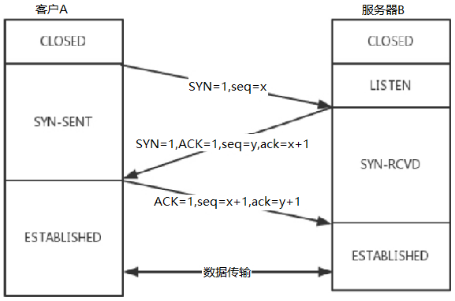
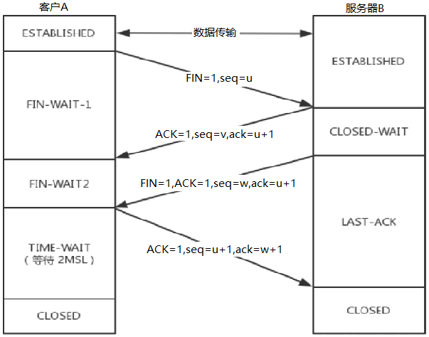

Table of Contents
=================

   * [Introduction](#introduction)
   * [05 Web server](#05-web-server)<br>
         * [5.1 Regex](#51-regex)
   * [04 Multitasking](#04-multitasking)<br>
         * [4.1 Thread](#41-thread)<br>
         * [4.2 Process](#42-process)<br>
         * [4.3 Coroutine](#43-coroutine)
   * [03 UDP and TCP](#03-udp-and-tcp)<br>
         * [3.1 UDP](#31-udp)<br>
         * [3.2 TCP](#32-tcp)
   * [02 Object Oriented Programming(OOP)](#02-object-oriented-programmingoop)<br>
         * [2.1 OOP basic grammer](#21-oop-basic-grammer)<br>
         * [2.2 Encapsulation (One feature of OOP)](#22-encapsulation-one-feature-of-oop)<br>
         * [2.3 Inheritance (One feature of OOP)](#23-inheritance-one-feature-of-oop)<br>
         * [2.4 Multiple inheritance](#24-multiple-inheritance)<br>
         * [2.5 Polymorphism (One feature of OOP)](#25-polymorphism-one-feature-of-oop)<br>
         * [2.6 Class Attributes](#26-class-attributes)<br>
         * [2.7 Class Methods](#27-class-methods)<br>
         * [2.8 Singleton Pattern (One of design Pattern)](#28-singleton-pattern-one-of-design-pattern)<br>
         * [2.9 Errors and Exception](#29-errors-and-exception)<br>
         * [2.10 Module](#210-module)<br>
         * [2.11 Read and write](#211-read-and-write)<br>
         * [2.12 Manipulate folder and file (OS)](#212-manipulate-folder-and-file-os)
   * [01 Procedure Oriented](#01-procedure-oriented)<br>
         * [1.1 Basic](#11-basic)<br>
         * [1.2 Branch](#12-branch)<br>
         * [1.3 Loop](#13-loop)<br>
         * [1.4 Function](#14-function)<br>
         * [1.5 Module](#15-module)<br>
         * [1.6 List and Tuple](#16-list-and-tuple)<br>
         * [1.7 Dictionary](#17-dictionary)<br>
         * [1.8 String](#18-string)<br>
         * [1.9 For](#19-for)<br>
         * [1.10 [Project] Name Card System](#110-project-name-card-system)<br>

# Introduction

This is the repository contains the code and difficulties I face when I learn python.

# 08 Mini-web

 In this folder, it talks about mini-web.

### 8.1 Change webserver to OOP

1. Demo *(LN_01)*

### 8.2 Divide static and dynamic data into two server

1. Divide static and dynamic data
   1. Server for getting request, and if found the request is for dynamic data, pass it to dynamic server  *(LN_01)*
   2. dynamic server deal with the dynamic request and return to server  *(LN_02)*

### 8.3 WSGI

1. **What is WSGI?** 

   It is a simple calling convention for web servers to forward requests to web applications or frameworks written in the Python programming language

   <div align=center>
      
   </div>Process:

   <div align=center>
      
   </div>

### 8.4 Process

1. Browser  send request - > Server
2. Server check if request is dynamic or static
   1. Static: get the data from harddisk
   2. Dynamic: use WSGL to tell framework, framework return the data to server
3. Sever combine header and body into response and send the response back to Browser

# 07 Mysql

 In this folder, it talks about mysql.

### 7.1 Mysql database grammer

1. start mysql

   ```mysql
   mysql -uroot -p
   ```

2. exit mysql

   ```mysql
   exit/quit/ctrl+d
   ```

3. show version of mysql

   ```mysql
   select version();
   ```

4. show all databases

   ```mysql
   show databases; 
   ```

5. create database

   ```mysql
   create database python2;
   create database python2 charset=utf8;
   ```

6. drop database

   ```mysql
   drop database python2;
   ```

7. show created database

   ```mysql
   show create database python2;
   ```

8. show database in use

   ```mysql
   select database();
   ```

9. use database

   ```mysql
   use python2;
   ```

### 7.2 Mysql table grammer

1. show all tables of current database

   ```mysql
   show tables;
   ```

2. [demo] create students table(id、name、age、high、gender、cls_id)

   constraint :auto_increment, not null, primary key, default 

   ```mysql
   create table students(
           id int unsigned not null auto_increment primary key,
           name varchar(30),
           age tinyint unsigned default 0,
           height decimal(5,2),
           gender enum("male", "female", "secret") default "secret",
           cls_id int unsigned
   );
   ```

3. show table description 

   ```mysql
   desc students;
   ```

4. [demo] drop table

   ```mysql
   drop table students;
   ```

5. [demo] show create table comment

   ```mysql
   show create table students;
   ```

6. [demo] add colume in students

   ```mysql
   alter table students add birthday datetime;
   ```

7. [demo] modify colume type in students

   ```mysql
   alter table students modify birthday date;
   ```

8. [demo] change colume name in students

   ```mysql
   alter table students change birthday birth date default "2000-01-01";
   ```

9. [demo] drop colume in students

   ```mysql
   alter table students drop height;
   ```

### 7.3 Mysql data grammer (crud)

1. [demo] insert into students (all)

   ```mysql
   insert into students values(0, "will", 20, "male", 1, "1990-01-01");
   insert into students values(null, "will", 20, "male", 1, "1990-01-01");
   insert into students values(default, "will", 20, "male", 1, "1990-01-01");
   --enum
   insert into students values(default, "will", 20, 1, 1, "1990-01-01");
   ```

2. [demo] insert into students (partial)

   ```mysql
   insert into students (name, gender) values ("will", 1);
   ```

3. [demo] insert into students (multi-line)

   ```mysql
   insert into students (name, gender) values ("will", 1),("jasmine", 2);
   insert into students values(default, "will", 20, 1, 1, "1990-01-01"), (default, "jasmine", 20, 2, 1, "1990-01-01");
   ```

4. [demo] change in students id = 3

   ```mysql
   update students set gender=1 where id=3;
   update students set age=22, gender=1 where id=3;
   ```

5. [demo] search in students

   ```mysql
   select * from students;
   select * from students where name="will";
   select * from students where id>3;
   select name,gender from students;
   select name as n,gender as g from students;
   select id, gender, name from students;
   ```

6. [demo] delete in students

   ```mysql
   delete from students;  --delete all
   delete from students where name="will";
   
   alter table students add is_delete bit default 0; -- do not real change, 0 for not delete, 1 for delete 
   update students set is_delete=1 where id=3;
   ```

### 7.4 Mysql data search grammer

1. use distinct can find the unique of a data

   ```mysql
   select distinct gender from students;
   ```

2.  “where” is condition

   Comparison operator: =, >, >=, <, <=, !=, <>

   Logical operator: and or not

   Fuzzy match: 

   	* like: normal like
   	* rlike: regex like
   	* %: unlimited char(0- unilimited)
   	* _: one char(1)

   Range match: in, between...and..., not between...and...

   Null match: is null, is not null **null is not equal to ""**

   ```mysql
   select * from students where id=1;
   -- Comparison operator
   select * from students where id > 3;
   -- Logical operator
   select * from students where id > 3 and gender=0;
   -- Fuzzy match
   select * from students where name like 'w%';
   select * from students where name like 'w_';
   select * from students where name rlike '^w.*';
   -- Range match
   select * from students where id in(1,3,8);
   select * from students where id between 3 and 8;
   -- Null match
   select * from students where height is null;
   select * from students where height is not null;
   ```

3. sort

   ```mysql
   select * from students where is_delete=0 order by name asc;
   select * from students where gender=1 and is_delete=0 order by name asc, id desc;
   ```

4. count, max, min, sum, avg, round

   ```mysql
   select count(*) from students;
   select max(id) from students where gender=2;
   select min(id) from students where is_delete=0;
   select sum(age) from students where gender=1;
   select avg(id) from students where is_delete=0 and gender=2;
   select round(sun(age)/count(*),2) from students
   ```

5. group

   ```mysql
   select gender from students group by gender;
   
   +--------+
   | gender |
   +--------+
   | male   |
   | female |
   | secret |
   +--------+
   
   select gender,group_concat(name) from students group by gender;
   
   +--------+-----------------------------------------------------------+
   | gender | group_concat(name)                                        |
   +--------+-----------------------------------------------------------+
   | male   | will, william                                						 |
   | female | jasmine														                       |
   | secret | anonimous                                                 |
   +--------+-----------------------------------------------------------+
   
   select gender,count(*) from students group by gender having count(*)>1;
   +--------+----------+
   | gender | count(*) |
   +--------+----------+
   | male   |        2 |
   +--------+----------+
   ```

6. limit

   ```mysql
   select * from students limit 5;
   select * from students limit 6,2;
   select * from students where is_delete=0 limit (n-1)*m,m;
   ```

7. connect two tables(inner join, left join, right join)

   ```mysql
   -- inner join
   select * from students inner join classes on students.cls_id = classed.id;
   select student.*, classes.name from students as s inner join classes as c on s.cls_id = c.id;
   -- left join
   select * from students as s left join classes as c on s.cls_id = c.id;
   select * from students as s left join classes as c on s.cls_id = c.id having c.id is null; 
   -- right join
   select * from classes as c right join students as s on s.cls_id = c.id;
   ```

8. Normal Form

   1. 1NF
   2. 2NF: base on 1NF, must have a primary key, others need to depend on primary key, can not depend partial
   3. 3NF: base on 2NF, can not be indirect depend
   4. ER model:
      1. one to many: add a key in the many table
      2. many to many: add a new table

### 7.5 Use mysql in python

1. install PyMySql

   ```bash
   python3 -m pip install PyMySql
   ```

2. Connect to mysql   *(LN_01)*

   1. start
   2. create a connection
   3. get cursor
   4. do the sql
   5. close cursor
   6. close connection
   7. Finish

3. Python search in mysql   *(LN_02)*

4. Python add, delete, change in mysql   *(LN_03)*

5. Sql injection: do not combine string, let execute function to combine that.

### 7.6 Mysql master-slave replication

1. backup database on master server

   ```bash
   mysqldump -uroot -p --all-databases --lock-all-tables > ~/master_db.sql
   ```

2. Copy master_db.sql to slave server and do the restore command

   ```bash
   mysql –uroot –p < master_db.sql
   ```

3. the log_bin on master server must be on and server id should be 1.

    ```bash
   sudo vim /etc/mysql/mysql.conf.d/mysqld.cnf     #to check the config
    ```

   <div align=center>
      
   </div>

4. server id of slave server must be different with master one

5. restart slave and master

   ```bash
   sudo service mysql restart
   ```

6. On master, create a mysql account for slave

   ```sql
   GRANT REPLICATION SLAVE ON *.* TO 'slave'@'%' identified by 'slave';
   FLUSH PRIVILEGES;
   ```

7. Use the command and remember the file and position, will be use in step 8

   ```sql
   show master status;
   +---------------+----------+--------------+------------------+-------------------+
   | File          | Position | Binlog_Do_DB | Binlog_Ignore_DB | Executed_Gtid_Set |
   +---------------+----------+--------------+------------------+-------------------+
   | xxxx          |    0000  |              |                  |                   |
   +---------------+----------+--------------+------------------+-------------------+
   ```

8. Test on slave check if it is done

   ```sql
   change master to master_host='[masterip]', master_user='slave', master_password='slave',master_log_file='xxxx', master_log_pos=0000;
   ```

   ```sql
   show slave status;
   Slave_IO_Running: Yes          # this one shows done
   Slave_SQL_Running: Yes         # this one shows done
   ```

   

# 06 Advanced Python

 In this folder, it talks about advanced python.

### 6.1 GIL

1. Single thread endless loop on the laptop  *(LN_01)*
2. Two threads endless loop on the laptop *(LN_02)*
3. Two processed endless loop on the laptop *(LN_03)*
4. **GIL only allow one thread at a time**. Global Interpreter Lock, is a boolean value in the Python interpreter, protected by a mutex.
5. **I/O bound: Threads/ Gevent   Compute bound: Multiprocesses**
6. Use C to avoid GIL  *(LN_04)*

### 6.2 Deep copy & Shadow copy

1. **Immutable variable**: tuple, int, string, float, bool

2. **Mutable variable**: dict, set, list

3. If copy something from a **all immutable variable**( can not be like list inside tuple, need all to be immutable variable), shadow copy and deepcopy will be reference.

4. If copy something **outside most is immutable variable**, shadow copy is only for reference, but deepcopy copy outer most and all mutable variable inside.

5. If copy something **outside most is mutable variable**, shadow copy copy outer most, inside still be reference, but deepcopy copy outer most and all mutable variable inside.

6. Shadow copy (outer most mutable, outer most will be copy, inside is still reference)

   <div align=center>
      
   </div>

7. Deep copy (outer most mutable, all will be real copy)

   <div align=center>
      
   </div>

8. if the original one change after the shodow copy, the shadow copy one will not change if the original one append a new item, only reference the copy items

   <div align=center>
      
   </div>

9. Slice list

   <div align=center>
      
   </div>

10. Dict copy

    <div align=center>
       
    </div>

### 6.3 Import(trick)

1. import will import the whole module, and can change variable inside that module

   <div align=center>
      
   </div>

2. from import will only use a variable to reference that value of the import thing, use equal to change only change the local one rather than the one in the module import

   <div align=center>
      
   </div>

### 6.4 MRO (C3 linearization algorithm)

1. Super() based on \__mro__ method. Parent do not use \_\_mro__ method.    **Recommend super()** 
2. Super() also can set parameter, **super(specified class in MRO, self)**, in this way, super will inherit based on the specified class.
3. Use parent to inherit, if two parent inherit from a same grandparent, the grandparent will be run for two times.   *(LN_01)* 
4. Use super() to inherit, it will inherit based on the \_\_mro__method, which will avoid two times running grandparent.  *(LN_02)* 

### 6.5 @Property

1. @property in python is easy to use because in this way, we do not need to consider about the parameters.

   ```python
   class Foo:
       @property
       def prop(self):
           pass
         
   foo_obj = Foo()
   foo_obj.prop
   ```

2. First way to create @property  (Decorator)

   Three methods in @property, class need inherit object (get, set, delete)

   ```python
   class Goods(object):
   
       def __init__(self):
           self.original_price = 100
           self.discount = 0.8
   		#get
       @property
       def price(self):
           new_price = self.original_price * self.discount
           return new_price
   		#set
       @price.setter
       def price(self, value):
           self.original_price = value
   		#del
       @price.deleter
       def price(self):
           del self.original_price
   
   obj = Goods()
   obj.price      	# get
   obj.price = 200	# set
   del obj.price		# del
   ```

3. Second way to create @property  (class attribute)

   ```python
   class Foo(object):
       def get_bar(self):
           print("getter...")
           return 'laowang'
   
       def set_bar(self, value): 
           """two parameters"""
           print("setter...")
           return 'set value' + value
   
       def del_bar(self):
           print("deleter...")
           return 'laowang'
   
       BAR = property(get_bar, set_bar, del_bar, "description...")
   
   obj = Foo()
   
   obj.BAR                # first parameter in property
   obj.BAR = "alex"       # second parameter in property
   desc = Foo.BAR.__doc__ # fourth parameter in property
   print(desc)
   del obj.BAR						 # third parameter in property
   ```

4. Third way to create @property  (Django)   *(LN_01)*

5. demo1 pages  *(LN_02)*

6. demo2 get set in class attributes  *(LN_03)*

7. Demo3 get set in decorator  *(LN_04)*

### 6.6 Magic method

1. \_\_doc__ method shows the description of the class

   ```python
   class Foo:
       """ description of Foo """
       def func(self):
           pass
   
   print(Foo.__doc__)
   # [output]description of Foo
   ```

2. \_\_class__ method shows which class create current oject

   ```python
   class T(object):
     """description of T"""
     
   t = T()
   t.__class__
   # [output]__main__.T
   ```

3. \_\_module__ method shows which module create current oject

   ```python
   class T(object):
     """description of T"""
     
   t = T()
   t.__module__
   # [output]__main__
   ```

4. \__init__  method and \_\_new__ method together create an object

   ```python
   class Person: 
       def __init__(self, name):
           self.name = name
           self.age = 18
   
   obj = Person('William')  
   ```

5. \__del__  method delete object

   ```python
   class Foo:
       def __del__(self):
           pass
   ```

6. \__call__  method

   ```python
   class Foo:
       def __init__(self):
           pass
   
       def __call__(self, *args, **kwargs):
           print('__call__')
   
   
   obj = Foo()  
   obj() # call method
   ```

7. \__dict__  method can check all attributes in a class or object

   ```python
   class City(object):
       country = 'Australia'
   
       def __init__(self, name, count):
           self.name = name
           self.count = count
   
       def func(self, *args, **kwargs):
           print('func')
   
   print(City.__dict__)
   # [output]{'__dict__': <attribute '__dict__' of 'City' objects>, '__module__': '__main__', 'country': 'Australia', '__doc__': None, '__weakref__': <attribute '__weakref__' of 'City' objects>, 'func': <function City.func at 0x101897950>, '__init__': <function City.__init__ at 0x1018978c8>}
   
   obj1 = City('Sydney', 10000)
   print(obj1.__dict__)
   # [output]{'count': 10000, 'name': 'Sydney'}
   
   obj2 = City('Canberra', 20000)
   print(obj2.__dict__)
   # [output]{'count': 20000, 'name': 'Canberra'}
   ```

8. \__str__  method

   ```python
   class Foo:
       def __str__(self):
           return 'William'
   
   
   obj = Foo()
   print("obj is %s" % obj)
   # [output]obj is William
   ```

9. \_\_getitem__  \_\_setitem__  \_\_delitem__  method

   ```python
   class Foo(object):
   
       def __getitem__(self, key):
           print('__getitem__', key)
   
       def __setitem__(self, key, value):
           print('__setitem__', key, value)
   
       def __delitem__(self, key):
           print('__delitem__', key)
   
   
   obj = Foo()
   
   result = obj['k1']      # run __getitem__
   obj['k2'] = 'william'   # run __setitem__
   del obj['k1']           # run __delitem__
   ```

10. \_\_getslice__  \_\_setslice__  \_\_delslice__  method

    ```python
    class Foo(object):
    
        def __getslice__(self, i, j):
            print('__getslice__', i, j)
    
        def __setslice__(self, i, j, sequence):
            print('__setslice__', i, j)
    
        def __delslice__(self, i, j):
            print('__delslice__', i, j)
    
    obj = Foo()
    
    obj[-1:1]                   # run __getslice__
    obj[0:1] = [11,22,33,44]    # run __setslice__
    del obj[0:2]                # run __delslice__
    ```

### 6.7 Contextmanager

1. with open

   ```python
   def m3():
       with open("output.txt", "r") as f:
           f.write("Python")
   ```

2. Every object contains \_\_enter__ and \_\_exit__  is  a context manager

   ```python
   class File():
   
       def __init__(self, filename, mode):
           self.filename = filename
           self.mode = mode
   
       def __enter__(self):
           print("entering")
           self.f = open(self.filename, self.mode)
           return self.f
   
       def __exit__(self, *args):
           print("will exit")
           self.f.close()
           
           
   with File('out.txt', 'w') as f:
       print("writing")
       f.write('hello, python')
   ```

3. Use contextmanager **Recommend**

   before yield is enter method, after yield is exit method

   ```python
   from contextlib import contextmanager
   
   @contextmanager
   def my_open(path, mode):
       f = open(path, mode)
       yield f
       f.close()
       
       
   with my_open('out.txt', 'w') as f:
       f.write("hello , the simplest context manager")
   ```

# 05 Web server

In this folder, it talks about web server.

### 5.1 Regex

1. All language have
   1. Match *(LN_01, LN_02)* 
2. In python
   1. Search -> the first one found
   2. Findall -> a list of all found
   3. Sub -> change the found with the parameter, also can call function
   4. Split -> split a string and return a list of substring

### 5.2 Hypertext Transfer Protocol(HTTP)

1. The response header(baidu as an example)

   ```http
   HTTP/1.1 200 OK
   Bdpagetype: 2
   Bdqid: 
   Cache-Control: private
   Connection: keep-alive
   Content-Encoding: gzip
   Content-Type: text/html;charset=utf-8
   Date: 
   Expires: 
   Server: BWS/1.1
   Set-Cookie: 
   Traceid: 
   X-Ua-Compatible: IE=Edge,chrome=1
   Transfer-Encoding: chunked
   ```

2. The request header(baidu as an example)

   ```http
   GET / HTTP/1.1
   Host: www.baidu.com
   Connection: keep-alive
   Cache-Control: max-age=0
   Upgrade-Insecure-Requests: 1
   User-Agent: Chrome Safari
   Accept: 
   Accept-Encoding: gzip, deflate
   Accept-Language: en,zh-CN;q=0.9,zh;q=0.8
   Cookie: 
   cp-extension-installed: Yes
   ```

3. Three handshakes

   <div align=center>
      
   </div>

4. Four waves

   <div align=center>
      
   </div>

5. Write a static webserver  *(LN_01)* 

6. Write an active webserver  *(LN_02)* 

7. Use multiprocessing to write an active webserver  *(LN_03)* 

8. Use threading to write an active webserver  *(LN_04)* 

9. Use gevent to write an active webserver  *(LN_05)* 

10. One process, one thread, non blocking  *(LN_06)* 

11. One process, one thread, non blocking, long connection  *(LN_07)*

12. Epoll (work in linux   **Recommend**)  *(LN_08)*

    1. Kernel share memory with server, kernal do not need to copy.

    2. select -> poll -> epoll

       ```python
       """
       create an epoll object
       """
       epl = select.epoll()
       # register listen socket fd into epl
       epl.register(listen_socket.fileno(), select.EPOLLIN)
       
       # make a dict to save the fds
       fd_event_list = dict()
       
       while True:
         fd_event_list = epl.poll()
         for fd, event in fd_event_list:
           if fd == listen_socket.fileno():
             serve_socket, client_address = listen_socket.accept()
             epl.register(serve_socket.fileno(), select.EPOLLIN)
             fd_event_listp[serve_socket.fileno()] = serve_socket
          	elif event == select.EPOLLIN:
             recv_data = fd_event_list[fd].recv(1024).decode("utf-8")
             if recv_data:
               serve_client(fd_event_list[fd], recv_data)
             else:
               fd_event_list[fd].close()
         
       ```

### 5.3 TCP/IP

1. tcp/ip transport layer

   <div align=center>
      
   </div>

2. tcp/ip encapsulation and decapsulation

   <div align=center>
      
   </div>

3. two computers connect

   <div align=center>
      
   </div>

4. Computers connect by hub (out-of-date)

   <div align=center>
      
   </div>

5. Computers connect by switch

   <div align=center>
      
   </div>

6. Computers connect by router

   <div align=center>
      
   </div>

7. Computer connect in internet

   <div align=center>
      
   </div>

8. In web

   1. **MAC address**: A media access control address is a unique identifier assigned to a network interface controller for use as a network address in communications within a network segment.
   2. **IP address**: a numerical label assigned to each device connected to a computer network that uses the Internet Protocol for communication.
   3. **IP subnet mask**: A subnetwork or subnet is a logical **subdivision** of an IP network.
   4. **Default gateway**: A default gateway is the node in a computer network using the internet protocol suite that serves as the forwarding host to **other networks** when no other route specification matches the destination IP address of a packet.
   5. Hub(out-of-date):  A hub is a physical layer networking device which is used to connect multiple devices in a network.
   6. **Switch**: A switch is a device in **a computer network** that connects other devices together.
   7. **Router**: A router is a networking device that forwards data packets **between computer networks**.
   8. **DNS server**(Domain Name System):  The Internet's system for converting alphabetic names into numeric IP addresses.

#  04 Multitasking

In this folder, it talk about multiytasking.

1. Parallel programming and Concurrent programming
   * Parallel programming: executing simultaneously
   * Concurrent programming: in progress at the same time

### 4.1 Thread

1. Threads are not in order, everyone can be the first  *(LN_01)*

2. Use thread to do a multitasking  *(LN_02)*

3. show the current threads  *(LN_03)*

   ```threading.enumerate()```

4. Threads share global variables  *(LN_04)*

5. Threads share global variables in arguments  *(LN_05)*

6. Threads share global variables sometimes will cause error  *(LN_06)*

   Because sometimes one thread still do not finish their works, but the cpu just swich to another thread.

7. How to fix the error in multitasking(thread) by using mutex *(LN_07)*

8. Know about mutex deadlock

9. [Project] UDP multitasking chatting program by thread  *(LN_08)*

### 4.2 Process

1. The different of program and process is that process is active and can use the hardware on the labtop, but the program is static

2. Use process to do a multitasking  *(LN_01)*

3. The difference of threads and processes

   * thread depends on process

   * process allocates memory, threads are working in this  memory

     eg. Process is a production line in a factory and threads are the workers working in that production line. Once the tasks is too much for one production line. the second production line(process) will be create and more workers(threads) will be hired.

4. Get pid of thread   *(LN_02)*

5. Processes are not in order  *(LN_03)*

6. Pass args to process  *(LN_04)* 

7. Processes are independent with each other, do not share global variable *(LN_05)*

8. Use queue to share between processes  *(LN_06)*

   **Mac python3.0 by default uses "spawn" instead of "fork" when start, The following need to add at the start of main  **

   ```python
   multiprocessing.set_start_method("fork")
   ```

   from https://stackoverflow.com/questions/60518386/error-with-module-multiprocessing-under-python3-8

9. Processing Pool  *(LN_07)*

10. [Project] Copy folder multitasking program by process  *(LN_08)*

11. Process states

    <div align=center>
       
    </div>

### 4.3 Coroutine

1. Iterator  *(LN_01, LN_02, LN_03)*

   1. Make an object iterable

      1. had ```__iter__(self)``` method inside the class which create the object
      2. The ```__iter__(self)``` method inside 1 must return an Iterator
      3. There must have ```__iter__(self)``` and ```__next__(self)``` method in the Iterator

   2. Justify if an object can Iterate 

      ```python
      from collections import Iterable
      isinstance(OBJECT, Iterable)
      ```

   3. Justify it is an Iterator

      ```python
      from collections import Iterator
      isinstance(OBJECT, Iterator)
      ```

   4. xrange() is using iterator and range() is using memory (in Python2)

   5. range() is using iterator (in Python3)

   6. Iterator only need the memory for code, but the normal way need the memory to save all the numbers

2. Generator  *(LN_04, LN_05, LN_06)*

   1. Generator is a kind of Iterator (but do not have iter and next method)
   2. Generator can stop in the yield and restart, the variable inside will not change
   3. If ```yield``` is in a function, then this is not function anymore and become a generator. Also, can not using this function anymore but create a generator
   4. next(Generator) and Generator.send("string")  can start generator
      * NEXT can not pass args but SEND can pass args
      * do not use SEND for the first one when there is no things outside of the loop to get the args

3. Yield Multitasking, Greenlet Multitasking, **Gevent Multitasking (use this)**  *(LN_07, LN_08, LN_09, LN_10)*

   1. Greenlet is an encapsulation of yield, is more concise
   2. Gevent is an encapsulation of greenlet
   3. Use monkey and joinall in gevent  **Recommend this**

4. Coroutine is one process, one thread, but just use the sleep time to do another thing, which is the most efficient

# 03 UDP and TCP

In this folder, it talk about UDP and TCP.

### 3.1 UDP

* Server:
  1. Create a udp server socket
  2. bind local information(for client to find it)
  3. receive the data from client (recvfrom()), use a while loop **STUCK here if do not get the data from client**
  4. send the data to the client if client request (sendto())
  5. close the udp server socket
* Client
  1. create a udp client socket
  2. send the request to the server by the server ip and port(sendto())
  3. receive data from server if there is (recvfrom())
  4. close udp client socket

1. udp and tcp can bind a same port (eg. 8080) at the same time
2. udp do not need to get a connect whereas tcp need

### 3.2 TCP

* Server:
  1. Create a tcp server socket(listen socket)
  2. bind local information(for client to find it)
  3. listening for the client
  4. wait for the data and create the client socket to serve client (accept())  **STUCK here if do not get the data from client**
  5. receive the request from the client and do some response
  6. send the data to the client if client request
  7. close the client socket
  8. close the  tcp server socket(listen socket)
* Client
  1. create a tcp client socket
  2. specify the server ip and port
  3. connect server
  4. send the request to the server
  5. receive data from server if there is
  6. close tcp client socket

1. In the example above, the server can serve many clients and also serve multiple times in the same time, need to specify the parameter in the listening method.

   ```tcp_server_socket.listen(128)  ``` in this way the server can serve 128 clients.

2. The server must bind the information for the client to find whereas the client do not need to.

3. listen method can make the server get the information from client

4. Client  socket is used to serve the client

5. if a client use close method, server will know and close the client socket for this client

# 02 Object Oriented Programming(OOP)

In this folder, it talk about all of the python OOP.

### 2.1 OOP basic grammer

* Create first class 🐱  *(LN_01)*
* when create the second 😺 , their addresses are different  *(LN_02)*
* parameter "self" inside method points to the Class itself
* use parameters to specify the attribute of an object  *(LN_04)*
* \_\_init\_\_, When the object made, init autoly run  *(LN_03)*
* \_\_del\_\_, When object go, del autoly run  *(LN_05)*
* \_\_str\_\_, return specified output of print(Object)  *(LN_06)*


### 2.2 Encapsulation (One feature of OOP)

* Two objects do not affect each other  *(LN_01, LN_02)*
* The attribute of an object can be another object  *(LN_03)*
* Python do not have real private, we can add "object.\_class\_\_attr" or "object.\_class\_\_method()" to get the private method and attr **NOT RECOMMEND**  *(LN_04)*


### 2.3 Inheritance (One feature of OOP)

* Child  class and Grandchild class can inherit all method from Father class  *(LN_01)*
* When the method of father is not good enough , overide that  *(LN_01)*
* Use super() to get the method of father class  *(LN_01)*
* Use father.method(self) **Python 2.x Not recommend**  *(LN_01)*
* Child can not get the private attr and private method of its father  *(LN_02)*
* Child can get the private attr and private method by the public method of its father  *(LN_03)*


### 2.4 Multiple inheritance

* Child class can inherit all Methods and all attrs of its all fathers  *(LN_01)*
* If fathers have the same method, avoid inheritance  *(LN_01)*
* **Object.\_\_mro\_\_** can show method resolution order in python  *(LN_02)*
* **Python 3.x inherit from object class automatically**, whereas Python 2.x not and need to specify object as father class. Recommend specify object as father class in order to adapt both 2.x and 3.x  *(LN_02)*


### 2.5 Polymorphism (One feature of OOP)

* Different child class call the same method of father class, the outcome is differernt. *(LN_01)*
* **This is based on inherit and overide the father class**


### 2.6 Class Attributes

* An **instance** is an object in memory, made by class
* Every **instance** has its own memory and have different instance attribute
* Every **Class** only be created once in memory 
* Every **Method inside class** only be create once in memory. The objects create by same class share memory of the method. 
* **Class is also an object, so it also has class attributes and class method** *(LN_01)*
* Can use object to get father class attribute from **grandchild -> father -> grandparent -> ... -> Object         Not recommend**  *(LN_02)*
* If want to use child.dadattr = to set an attr, this only add a new attr to the grandchild, can not change the attr of  its dad. So not recommend for the previous one  *(LN_03)*


### 2.7 Class Methods

* There are three method, instance method, class method and static method
* Class method example, need @classmethod *(LN_01)*
* Static method example, need @staticmethid, do not need instance just class.staticmethod()  *(LN_02)*
* Combine class attributes and class method *(LN_03)*


### 2.8 Singleton Pattern (One of design Pattern)

* \_\_new__ method is used to allocate address for object, and need to return object to \_\_init__  *(LN_01)*
* Can change \__new__ method in order to satisfy Singleton Pattern  *(LN_02)*
* Can change \__init__ method in order to make init only execute once  *(LN_03)*


### 2.9 Errors and Exception

* Use try except to get the error  *(LN_01)*
* Use different except to get different error  *(LN_02)*
* Use "except Exception as result"  to get unknown error  *(LN_03)*
* The code inside else will occur when no error, the code inside finally will always occur  *(LN_04)*
* Exception pass can let us only try except in the main, to make us easy  *(LN_05)*
* Can use Exception class to make a user-define exception *(LN_06)*


### 2.10 Module

* Review import module *(LN_01, LN_02, LN_03)*
* can use "import xxxx as xx" to give the module a alias *(LN_01)*
* can use "from xxxx inport xx" to specify the Function or class which want to import   *(LN_04)*
* If import same function from different module, the last one will be valid. Or use as to avoid this conflict  *(LN_05)*
* can use "from xxxx inport \*" to import all from module **Not recommend**  *(LN_06)*
* The order import module **local folder -> system folder**, use random\__file__ to see the absolute path of that module  *(LN_07)*
* Make sure every file is able to import
* \_\_name__ == "\_\_main\_\_" is used to test. when others inport, the code inside main will not execute **Very Recommend**  *(LN_08, LN_09)*
* How to create package: two ways *(LN_10_package)*
* We must specify the module we want to let outside import inthe init.py file  *(LN_10_package, LN_10_import_package)*
* Use setup if we want to share our module to other developers

### 2.11 Read and write

* Read file *(LN_01)*
* When call read(), the read pointer will go to the end of file   *(LN_02)*

| Para | Description                                                  |
| :--: | :----------------------------------------------------------- |
|  r   | Read Only, read pointer will be at beginning, this is the **default** way. If the file not exist, throw exception |
|  w   | Write Only. If file exists, overwrite that. If file not exists, make a new one. |
|  a   | Append Only. If the file exists, the pointer will at the end of the file. If file not exists, make a new one. |
|  r+  | Read and write, read pointer will be at beginning. If the file not exist, throw exception |
|  w+  | Read and write. If file exists, overwrite that. If file not exists, make a new one. |
|  a+  | Read and write. If the file exists, the pointer will at the end of the file. If file not exists, make a new one. |

* When call readline(), only the first line will be read.  *(LN_05)*
* Copy small: Read a file and write it to a new file.  *(LN_06)*
* Copy large: Readline a file and write it to a new file.  *(LN_07)*

### 2.12 Manipulate folder and file (OS)

* Manipulate file

| 01   | rename | Rename file | `os.rename(origin filename, target filename)` |
| ---- | ------ | ----------- | --------------------------------------------- |
| 02   | remove | delete file | `os.remove(filename)`                         |

* Manipulate folder

| 01   | listdir    | list dir                 | `os.listdir(folder name)`      |
| ---- | ---------- | ------------------------ | ------------------------------ |
| 02   | mkdir      | Create dir               | `os.mkdir(folder name)`        |
| 03   | rmdir      | delete dir               | `os.rmdir(folder name)`        |
| 04   | getcwd     | Current dir              | `os.getcwd()`                  |
| 05   | chdir      | Change dir to target     | `os.chdir(target folder name)` |
| 06   | path.isdir | Jusitify if it is folder | `os.path.isdir(folder name)`   |

<br>

<br>

# 01 Procedure Oriented

In this folder, it talk about all of the python basic.

### 1.1 Basic

* Basic grammer for python.

### 1.2 Branch

* if, elif and else are the keyword for branch.

### 1.3 Loop

* While loop is a type of loop which can run typical code for several time.

### 1.4 Function

* Def is the key word to define a function in python.

### 1.5 Module

* Every .py file is a module and we can use import to use the function of other module.

### 1.6 List and Tuple

* LIst and Tuple are two data type of python
* They are ordered and list can be change and tuple can not
* There are many function for list and only two for tuple which is index and count.

### 1.7 Dictionary

* Dictionary is one data type of python
* It has key and value. Key and value are in pair. Dictionary is inordered.

### 1.8 String

* String is one data type of python. There are many functions for String.

### 1.9 For

* For each is a typical type of for loop, the code inside the each will occur if the for loop finish without break.

### 1.10 [Project] Name Card System

* This is a Name Card System which can add, show and search the cards.
